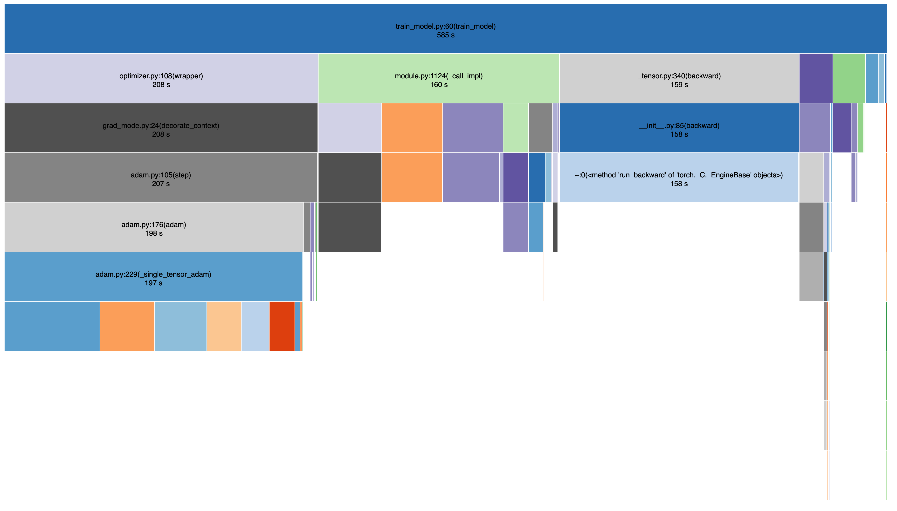

# Training Performance Analysis and Optmization - ResNet-50 on CIFAR-100

In this project, I performed a performance benchmark and analysis for a typical type of deep learning tasks - transfer learning. The process involves fine-tuning a pretrained model on a different task it was pretrained on. The model of choice is ResNet-50 which was pretrained on the ImageNet datasets, and the task of interest is the CIFAR-100 classification task. During the process, I would apply several variants of performance optimization techniques, namely pinned memory, PyTorch JIT scripts (or TorchScript), and NVIDIA cuDNN autotuner. I obtained the performance benchmarks for these variants along with the baseline and a detailed analysis was performed and listed in the following section.

## Repository Outline

- `imgs`: a directory for diagrams and screenshots
- `profile`: a directory that contained the profiler result
- `model`: a directory that contains the trained model (will be created during training)
- `train_model.py`: the main entrypoint for performing the experiment.

## Commands to Run

There are a number of pre-requisites to install before running the training script:

```bash
pip install -U torch torchvision numpy matplotlib scikit-learn tqdm
```

To reproduce the training and benchmark results, run the following command:

```python
python train_model.py
```

There are plenty of options to enable different variants (and combinations of variants). Use `--help` to get all the available options.

```
usage: resnet50-cifar100 [-h] [--cudnn-autotuner] [--use-torchscript]
                         [--batch-size BATCH_SIZE] [--num-workers NUM_WORKERS]
                         [--pin-memory] [--n-epochs N_EPOCHS]
                         [--profile {cprofile,torch}] [--dry-run]

optional arguments:
  -h, --help                 show this help message and exit
  --cudnn-autotuner          Apply cuDNN autotuner.
  --use-torchscript          Use TorchScript JIT.
  --batch-size BATCH_SIZE
  --num-workers NUM_WORKERS
  --pin-memory               Use pinned memory
  --n-epochs N_EPOCHS
  --profile {cprofile,torch} Choose the profiler, defaut to cProfile
  --dry-run
```

When the training completes, the script spits out two files and one output: a model checkpoint file, a profile file, and the accuracy of the trained model on the validation set.

To visualize the profiling result, please use `snakeviz`.

```bash
snakeviz --server <profile filename>
```

## Results and Observations

To adapt ResNet-50 to this new learning task we have, we must first tweak some of its internal structure, mainly the last fully-connected layer. Instead of producing 1000 logits, we now only want 100 outputs.


I loaded the pretrained model provided by TorchVision and replaced the last fully-connected layer. Then I trained this new model on the CIFAR-100 training set for 20 epochs with `Adam` optimizer and `CrossEntropyLoss`. 

### Baseline

From there I have obtained my baseline performance benchmark shown below:


I verified the effectiveness of my transfer learning approach by evaluating the model on the validation set. The prediction accuracy jumped from 1% to ~50%, proving that the training process is sound.

### Pinned Memory

Pinned memory allows for faster and asynchronous memory copy from the host to the GPU. As we can observe from the profiling result, the amount of time spent in loading data (by `dataloader.py`) has been significantly reduced compared to the baseline: from 28.1s in baseline to 20.7s with pinned memory enabled. Surprisingly, while pinned memory does not have a noticable impact on the forward and backward probabagation, it does seem to have a tiny boost on the optimization process. Though the difference can also be attributed to measurement noise.



### cuDNN AutoTuner

As stated in the documentation, NVIDIA cuDNN supports multiple convolution algorithms, and we can enable the auto-tuner in hopes that we can find a better convolution kernel than the defaults, which (ideally) will have a positive impact on the forward and backward propagation. However, this does not seems to be the case in experiments as there are no difference in performance when compared to the baseline.

This might have been caused by the fact that CIFAR-100 inputs are relatively small images (32x32) and the default kernel actually might be the most efficient. Thus there are no better kernels to choose from.


### TorchScript

TorchScript, or PyTorch JIT, allows models to be serialized and optimized, and even executed in a Python-free environment. It removes much of the Python overhead, allows for lower abstraction cost and true multithreading, thus can be a serious performance booster. And we do observe that in the experiment.


In the profiling result, notice how the stack trace for forward propagation has been trimmed in depth compared to other variants, which is likely because of TorchScript's optimization. We also noticed a significant drop in forward propagation time, from ~160s to ~110s. Surprisingly, the time spent in optimization has not been significantly reduced (by only ~10s), and the time spent in backward propagation actually shot up, from ~160s to ~190s. Thankfully, overall we still see a significant performance boost compares to the baseline. The increase in backward propagation delay may have been caused by additional overhead of untangling the model optimized for forward propagation.

### All Optimization Combined

With no surprise, when we apply all three optimization technique, we obtain the best training performance out of all variants.


The following is a summary of time breakdown in each benchmark.

|Method|Forward Propagation|Backward Propagation|Optimizer|Data Loading|Total|
|:---|---:|---:|---:|---:|---:|
|Baseline|158s|160s|217s|28s|602s|
|Pinned Memory|160s|158s|208s|***20s***|585s|
|cuDNN Autotuner|159s|159s|215s|26s|597s|
|TorchScript|***110s***|***193s***|202s|30s|574s|
|All Optimizations|113s|195s|202s|22s|568s|

